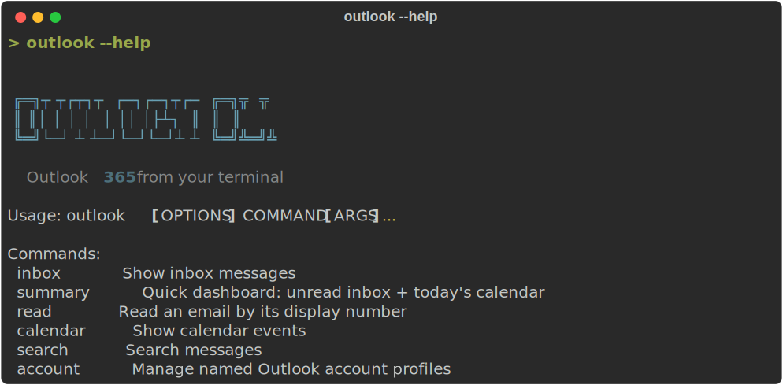
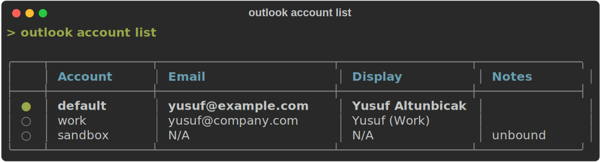
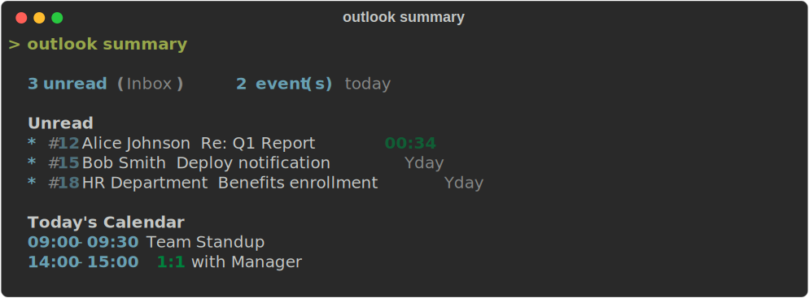
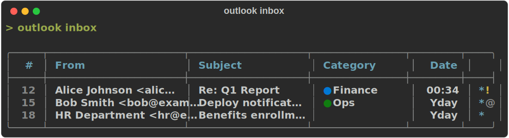
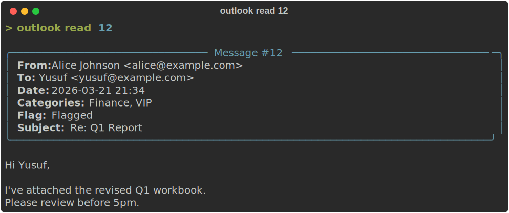
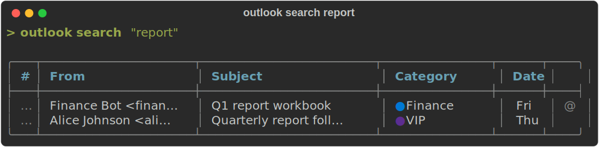
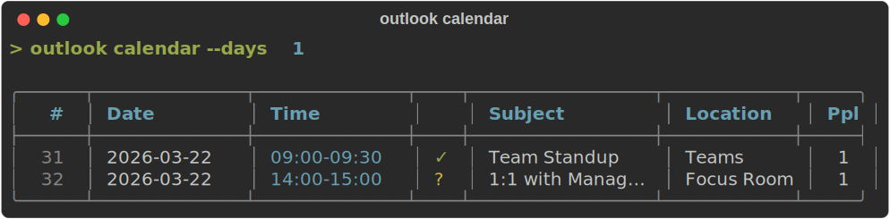

# outlook-cli

Read, send, and manage Outlook 365 emails, calendar events, and contacts from the terminal.

Uses OWA bearer token authentication via Playwright — no admin consent or API keys required.

<p align="center">
  
</p>

> **Disclaimer**: This is an unofficial, community-driven project. It is **not affiliated with, endorsed by, or supported by Microsoft Corporation**. "Outlook" and "Microsoft 365" are trademarks of Microsoft Corporation.
>
> This tool accesses Microsoft Outlook services using intercepted browser tokens and, in some cases, undocumented internal APIs (OWA `service.svc`). **Use of this tool may violate [Microsoft's Terms of Service](https://www.microsoft.com/en-us/servicesagreement)** or your organization's acceptable use policies. The authors accept no responsibility for account suspensions, data loss, or other consequences arising from the use of this tool.
>
> **Use at your own risk.** This software is provided "as is", without warranty of any kind. See [LICENSE](LICENSE) for details.

## Install

```sh
pip install outlook365-cli
playwright install chromium
```

## Auth

```sh
outlook login                              # opens browser, captures token automatically
outlook login --force                      # force re-login, ignore saved session
echo $TOKEN | outlook login --with-token   # skip browser, read token from stdin
outlook login --with-token < token.txt     # read token from file
outlook whoami                             # verify current user

outlook account add work
outlook account add personal
outlook account list
outlook account current
outlook account switch work
outlook account remove personal -y
outlook whoami --account personal
```

Every non-account command accepts `--account NAME` for one-off overrides.
`outlook whoami` includes the active profile in both table and JSON output.

<p align="center">
  
</p>

Account selection precedence:
1. `--account NAME`
2. `OUTLOOK_ACCOUNT`
3. persisted current account (`accounts.json`)
4. implicit `default`

Auto re-login is profile-aware. You can still set `OUTLOOK_TOKEN` directly, but for bound profiles it must match the mailbox already bound to that profile.

### Account Storage

Global roots:

- Cache root: `~/.cache/outlook-cli/`
- Config root: `~/.config/outlook-cli/`
- Account registry: `~/.config/outlook-cli/accounts.json`

Per-profile state lives under:

- Cache: `~/.cache/outlook-cli/accounts/<profile>/`
- Config: `~/.config/outlook-cli/accounts/<profile>/`

Profile-scoped files:

- `token.json`
- `browser-state.json`
- `id_map.json`
- `scheduled.json`
- `signatures/`
- `config.yaml`

Existing single-account installs continue to work through the implicit `default` profile and legacy paths until a per-profile `default/` directory exists.

Bearer tokens are now stored in your OS keychain/keyring. The `token.json` file remains on disk only as non-secret metadata (`expires_at`, mailbox identity, storage marker). On first use, older plaintext `token.json` files are migrated automatically into the keyring.

## Exit Codes

For automation and scripting, `outlook` uses stable process exit codes:

- `0` success
- `1` generic failure
- `2` usage / bad parameters
- `4` authentication required / session expired
- `5` resource not found
- `7` rate limited
- `8` retryable transient error
- `10` configuration or account/storage error
- `130` interrupted

## Usage

Examples with an explicit profile:

```sh
outlook inbox --account work
outlook summary --account work
outlook send "a@example.com" "Subject" "Body" --account personal
outlook schedule-list --account work
```

### Summary

```sh
outlook summary
outlook summary --json
```

<p align="center">
  
</p>

### Inbox

```sh
outlook inbox                          # list inbox (shows unread/total count)
outlook inbox --unread                 # unread only
outlook inbox -n 10                    # last 10 messages
outlook inbox --from "john"            # filter by sender
outlook inbox --subject "report"       # filter by subject
outlook inbox --after 2026-03-01       # after date
outlook inbox --before 2026-03-08     # before date
outlook inbox --has-attachments        # only with attachments
outlook inbox --category "Urgent"      # filter by category
outlook inbox --no-category            # only uncategorized messages
outlook inbox -n 50 --no-category      # find 50 uncategorized messages
```

<p align="center">
  
</p>

### Read / Search / Thread

```sh
outlook read 3                 # read message #3
outlook read 3 --raw           # raw HTML body
outlook thread 3               # full conversation thread for message #3
outlook open 3                 # open message #3 in Outlook on the web
outlook search "keyword"       # search messages
outlook search "from:john" --max 10
outlook open 42                # open event #42 in Outlook on the web
```

<p align="center">
  
</p>

<p align="center">
  
</p>

### Send / Reply / Forward

All send commands show a confirmation prompt before sending. Use `-y` to skip.

```sh
outlook send "to@email.com" "Subject" "Body"
outlook send "to@email.com" "Subject" --body-file message.txt
printf 'Body from stdin' | outlook send "to@email.com" "Subject" --body-file -
outlook send "a@b.com,c@d.com" "Subject" "Body" --cc e@f.com -y
outlook send "to@email.com" "Subject" "Body" --signature MySignature
outlook send "to@email.com" "Subject" "<h1>HTML</h1>" --html -s MySignature
outlook send "to@email.com" "Report" "See attached" -a report.pdf
outlook send "to@email.com" "Files" "Here" -a file1.pdf -a file2.xlsx
outlook reply 3 "Thanks!"
printf 'Thanks from stdin' | outlook reply 3 --body-file -
outlook reply 3 "Thanks!" --all
outlook reply 3 "Here it is" --attach requested-file.pdf
outlook reply-draft 3                          # create reply draft without sending
outlook reply-draft 3 "Will check" --all       # reply-all draft with body
outlook reply-draft 3 --body-file reply.html --html
outlook reply-draft 3 "<p>HTML</p>" --html     # HTML body (preserves quoted original)
outlook reply-draft 3 "Body" -s MySignature    # reply draft with signature
outlook forward 3 "to@email.com" --comment "FYI"
outlook forward 3 "to@email.com" -a extra-doc.pdf
```

### Drafts

```sh
outlook draft "to@email.com" "Subject" "Body"              # create draft
outlook draft "to@email.com" "Subject" --body-file draft.txt
outlook draft "to@email.com" "Subject" "Body" --cc e@f.com # draft with CC
outlook draft "to@email.com" "Subject" "Body" -a file.pdf  # draft with attachment
outlook draft "to@email.com" "Subject" "Body" -s MySignature # draft with signature
outlook draft-send 3                                        # send a draft (with confirmation)
outlook draft-send 3 -y                                     # send without confirmation
```

### Scheduled Send

```sh
outlook schedule "to@email.com" "Subject" "Body" "+1h"        # send in 1 hour
printf 'Scheduled body' | outlook schedule "to@email.com" "Subject" "+1h" --body-file -
outlook schedule "to@email.com" "Subject" "Body" "+30m" -y    # 30 min, skip confirm
outlook schedule "to@email.com" "Subject" "Body" "tomorrow 09:00"
outlook schedule "to@email.com" "Subject" "Body" "2026-03-15T10:00"
outlook schedule "to@email.com" "Subject" "Body" "+2h30m" --html -s MySignature
outlook schedule "to@email.com" "Report" "See attached" "+1h" -a report.pdf

outlook schedule-draft 3 "+1h"            # schedule an existing draft
outlook schedule-draft 3 "tomorrow 09:00" # schedule reply draft for morning

outlook schedule-list                     # list scheduled emails
outlook schedule-list --json

outlook schedule-cancel 1                 # cancel by list number
outlook schedule-cancel 1 -y              # skip confirmation
```

Time formats: `+30m`, `+1h`, `+2h30m`, `today 17:00`, `tomorrow 09:00`, `2026-03-15T10:00`.

### Folders

```sh
outlook folders                        # list folders with counts
outlook folder Archive -n 20           # messages in a folder
outlook folder Archive --category "Urgent"  # filter by category
outlook move 3 Archive                 # move message to folder
outlook move 3 4 5 Archive             # move multiple messages
outlook copy 3 Finance                 # copy message to folder
outlook copy 3 4 5 Finance             # copy multiple messages
```

### Categories

```sh
outlook categories                         # list categories with counts
outlook categorize 3 "FYI"                 # add category to message
outlook categorize 3 4 5 "FYI"             # add to multiple messages
outlook uncategorize 3 "FYI"               # remove category from message
outlook uncategorize 3 4 5 "FYI"           # remove from multiple messages
outlook category-create "New Category"     # create master category
outlook category-create "Urgent" --color 0 # create with color (0-24)
outlook category-rename "FYI" "Info"       # rename + update all messages
outlook category-rename "FYI" "Info" --no-propagate  # master list only
outlook category-clear "FYI"               # remove category from all messages
outlook category-clear "FYI" -n 20         # remove from max 20 messages
outlook category-clear "FYI" --folder Inbox # remove only in Inbox
outlook category-delete "Old" -y           # delete master + clear all messages
outlook category-delete "Old" --no-propagate -y  # delete master only
```

### Signatures

```sh
outlook signature-pull -n MySignature  # extract signature from sent emails
outlook signature-list                 # list saved signatures
outlook signature-show MySignature     # preview a signature
outlook signature-delete MySignature   # delete a saved signature
```

Signatures are saved per profile in `~/.config/outlook-cli/accounts/<profile>/signatures/`. Set a default in config:

```yaml
default_signature: MySignature
```

### Management

```sh
outlook mark-read 3              # mark as read
outlook mark-read 3 4 5          # mark multiple as read
outlook mark-read 3 --unread     # mark as unread
outlook delete 3                 # delete (with confirmation)
outlook delete 3 4 5 -y          # delete multiple without confirmation
outlook flag 3                   # flag for follow-up
outlook flag 3 --due tomorrow    # flag with due date
outlook flag 3 --due 2026-03-20  # flag with specific date
outlook flag 3 --due +3d         # flag due in 3 days
outlook flag 3 --complete        # mark flag as complete
outlook flag 3 --clear           # remove flag
outlook pin 3                    # pin to top of inbox
outlook pin 3 4 5                # pin multiple
outlook pin 3 --unpin            # unpin
outlook open 3                   # open message or event in browser
outlook open 3 --print-url       # print the OWA URL instead of opening it
```

### Calendar

```sh
outlook calendar                                      # next 7 days
outlook calendar --days 14                            # next 14 days
outlook calendar --days -7                            # past 7 days
outlook calendar --days -30                           # past 30 days
outlook calendar --timezone Asia/Shanghai             # convert times to timezone
outlook calendar --timezone UTC+8                     # fixed offset also works
outlook calendar --calendar "John Smith"              # view a shared calendar
```

<p align="center">
  
</p>

### Events

```sh
outlook event 42                          # view event details (attendees, recurrence, etc.)

# Create
outlook event-create "Meeting" "2026-03-16 10:00" "2026-03-16 11:00"
outlook event-create "Meeting" "tomorrow 14:00" "+1h" \
  -a john@example.com -a jane@example.com \
  -l "Room A" -b "Agenda: Q1 review" -y
outlook event-create "Standup" "2026-03-16 09:00" "2026-03-16 09:30" \
  --teams -a team@example.com               # Teams online meeting

# Recurring events
outlook event-create "Weekly Sync" "2026-03-16 10:00" "2026-03-16 11:00" \
  --repeat weekly --repeat-count 8 -a team@example.com
outlook event-create "Daily Standup" "2026-03-16 09:00" "2026-03-16 09:15" \
  --repeat daily --repeat-until 2026-04-30
outlook event-create "Sprint Review" "2026-03-16 14:00" "2026-03-16 15:00" \
  --repeat weekly --repeat-days Monday,Wednesday --repeat-count 12
outlook event-create "Monthly Report" "2026-03-16 10:00" "2026-03-16 11:00" \
  --repeat monthly --repeat-count 6

# Update
outlook event-update 42 --subject "New Title"
outlook event-update 42 --start "2026-03-16 14:00" --end "2026-03-16 15:00"
outlook event-update 42 --location "Room B"
outlook event-update 42 --add-attendee new@example.com
outlook event-update 42 --remove-attendee old@example.com

# Delete
outlook event-delete 42                    # delete single event/occurrence
outlook event-delete 42 --series           # delete entire recurring series
outlook event-delete 42 43 44 -y           # delete multiple

# Respond to invitations
outlook event-respond 42 accept
outlook event-respond 42 decline --comment "Can't make it"
outlook event-respond 42 tentative --silent  # don't notify organizer

# Recurring event instances
outlook event-instances 42                 # list all occurrences (90 days)
outlook event-instances 42 --days 180      # look further ahead
```

### Calendars / Free-Busy / People

```sh
outlook calendars                          # list all calendars (own + shared)

outlook free-busy "john@example.com" tomorrow
outlook free-busy "a@b.com,c@d.com" 2026-03-16 -d 30   # 30-min slots

outlook people-search "john"               # find people for attendee autocomplete
outlook people-search "john" --max 5
```

### Attachments / Contacts

```sh
outlook attachments 3          # list attachments
outlook attachments 3 -d       # download all
outlook contacts
```

## JSON Output

**Auto-JSON on pipe:** When stdout is piped, JSON output is automatic — no `--json` flag needed.

```sh
outlook inbox | jq '.data[0].subject'        # auto-JSON when piped
outlook inbox --json                          # explicit JSON in terminal
outlook inbox --json -o emails.json           # save to file
```

All JSON output uses a structured envelope:

```json
{"ok": true, "schema_version": "1", "data": [...]}
```

## How It Works

1. `outlook login` opens Chromium via Playwright
2. Intercepts the OWA bearer token from network requests
3. Uses the token against Outlook REST API v2 (`outlook.office.com/api/v2.0/`)
4. Category management and message pinning use OWA `service.svc` (reverse-engineered internal endpoints)
5. Messages get short display numbers (#1, #2...) mapped to real Outlook IDs
6. Auto re-login on token expiry via cached browser SSO state

## Security Notice

This tool caches sensitive authentication data on your local machine:

- **Bearer token** — stored in your OS keychain/keyring under the `outlook-cli` service.
- **Token metadata** (`~/.cache/outlook-cli/token.json` or `~/.cache/outlook-cli/accounts/<profile>/token.json`) — non-secret metadata such as `expires_at`, mailbox identity, and storage marker.
- **Browser session state** (`~/.cache/outlook-cli/browser-state.json` or `~/.cache/outlook-cli/accounts/<profile>/browser-state.json`) — contains cookies and SSO state that can be used to obtain new tokens without re-authentication.

Cache files are created with `600` permissions (owner-only read/write) on Unix systems. Never share browser state files or commit them to version control.

To revoke access for all profiles, delete the cache directory:

```sh
rm -rf ~/.cache/outlook-cli/
```

If you also want to clear stored bearer tokens, remove the `outlook-cli` entries from your OS keychain/keyring.

To revoke access for a single named profile, delete its scoped cache directory:

```sh
rm -rf ~/.cache/outlook-cli/accounts/<profile>/
```

## Undocumented API Notice

Category management commands (`categories`, `category-create`, `category-delete`, `category-rename`) and the `pin` command use a reverse-engineered OWA internal endpoint (`service.svc`) that is **not a public or documented Microsoft API**. These endpoints may change or stop working at any time without notice. All other commands use the [Outlook REST API v2.0](https://learn.microsoft.com/en-us/previous-versions/office/office-365-api/api/version-2.0/mail-rest-operations), which is a documented (though deprecated in favor of Microsoft Graph) API.

## Config

`~/.config/outlook-cli/config.yaml`:

```yaml
max_messages: 25
default_folder: Inbox
default_signature: null       # set to signature name for auto-append
timezone: UTC                 # output timezone for calendar commands (UTC, UTC+8, Asia/Shanghai)
browser:
  headless: false
  timeout: 120
output_format: table
```

Per-profile overrides are loaded from `~/.config/outlook-cli/accounts/<profile>/config.yaml` and are deep-merged on top of the global config.

## Development

```sh
git clone https://github.com/yusufaltunbicak/outlook-cli.git
cd outlook-cli
pip install -e ".[dev]"
playwright install chromium
pytest
python screenshots/generate_demos.py
```
